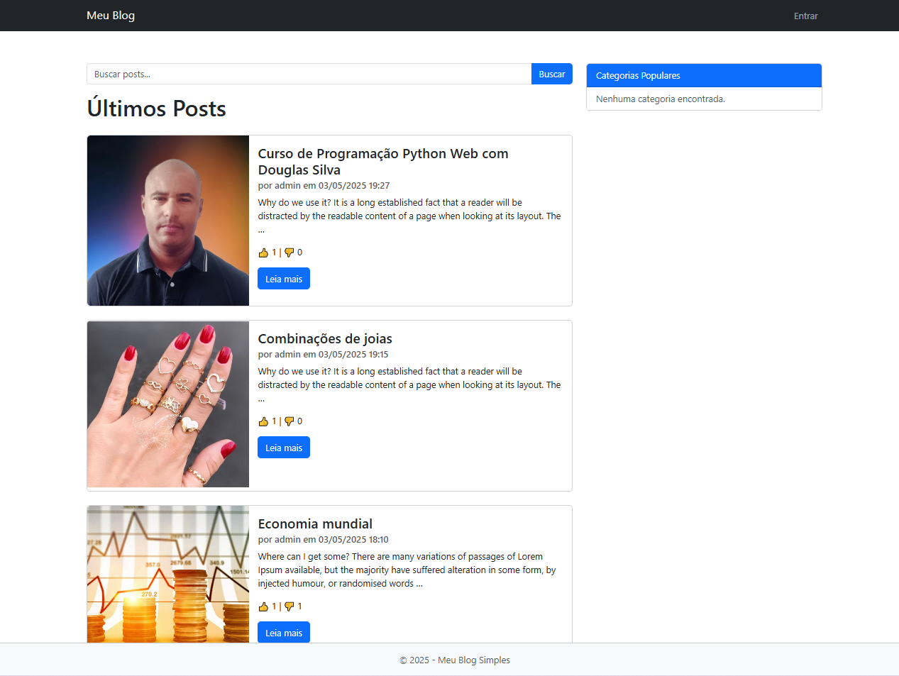
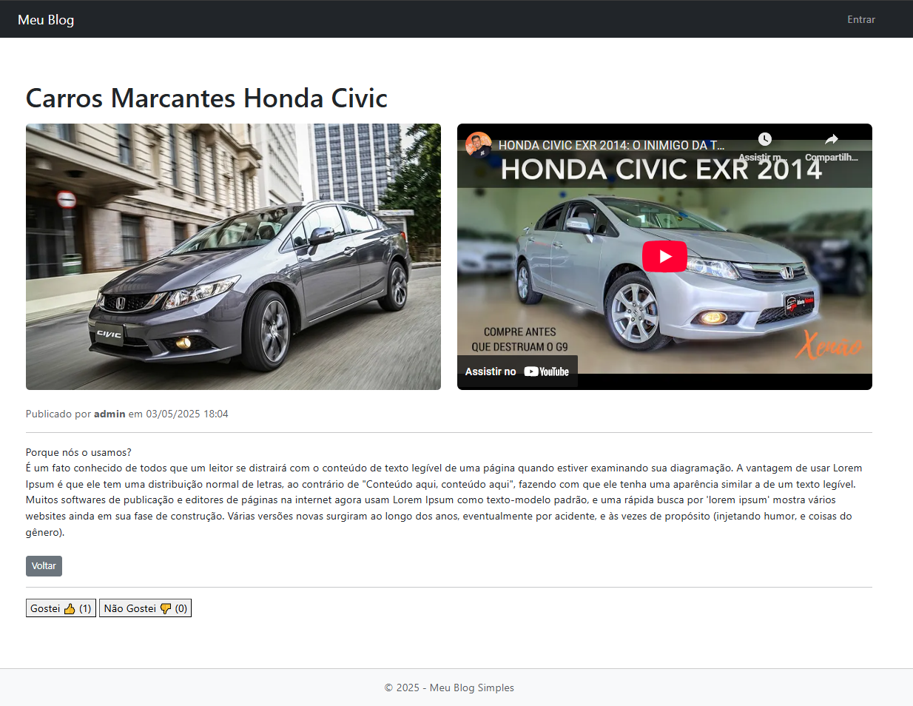
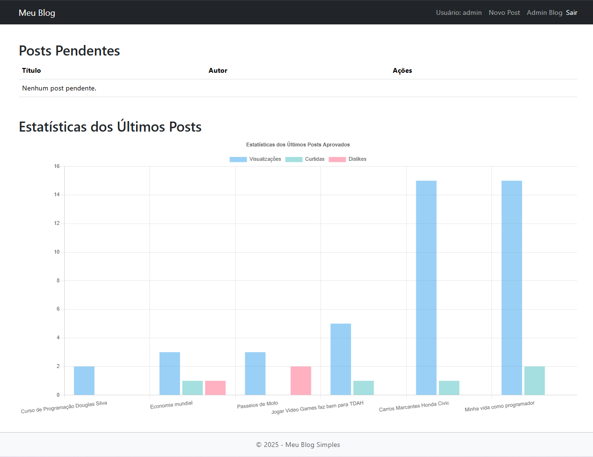

# Blog Simples com Django

Este é um projeto de **Blog Simples** desenvolvido com Django. O sistema permite publicar posts, 
aprovar ou recusar publicações pelo admin, além de permitir que usuários anônimos interajam 
com as postagens utilizando **botões de "Gostei" e "Não Gostei"**, sem precisar de login.

## Funcionalidades

- Cadastro, edição e remoção de posts via Django Admin
- Sistema de aprovação/recusa de postagens
- Publicação e despublicação de posts
- Interações anônimas com:
  - Botão de Gostei
  - Botão de Não Gostei
  - Prevenção de múltiplos votos com cookies
- Visualização das métricas de votos por postagem
- Layout com Bootstrap 5 responsivo

## Recursos e Extras
- Cookies impedem que o mesmo usuário vote mais de uma vez (por navegador/dispositivo).
- As interações são registradas em tempo real via JavaScript (fetch API).

## Imagens do Projeto

### Tela Postagem

### Tela Login

### Menus para logados

### Tela nova Postagem

### Tela detalhe da Postagem

### Tela Administrativa do blog

## Licença
Este projeto está licenciado sob a MIT License.

## Autor
Douglas R. Silva
[Meu LinkedIn](https://www.linkedin.com/in/douglas-roberto-da-silva-7083b96a/) • [Meu GitHub](https://github.com/douglasinforj)