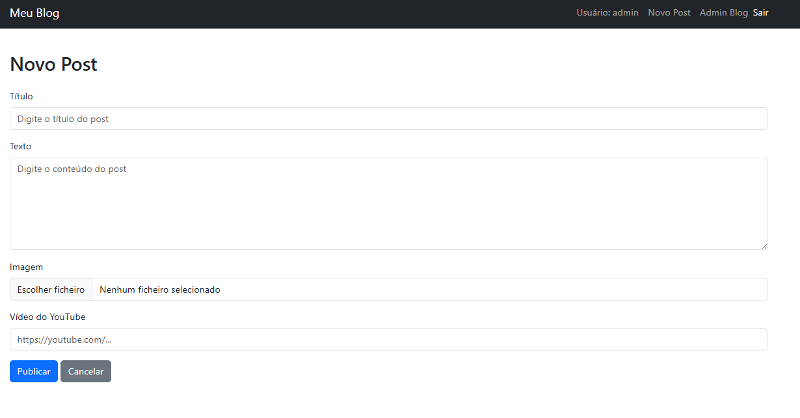

# Blog Simples com Django

Este é um projeto de **Blog** desenvolvido com Django. O sistema permite publicar posts, 
aprovar ou recusar publicações pelo admin, além de permitir que usuários anônimos interajam 
com as postagens utilizando **botões de "Gostei" e "Não Gostei"**, sem precisar de login.

## Funcionalidades

- Cadastro, edição e remoção de posts via Templates e Django Admin
- Busca por título ou conteúdo
- Upload de imagens para cada post
- Possibilidade de adicionar link de vídeo do YouTube (embed lado a lado com a imagem)
- Sistema de aprovação/recusa de postagens pendentes pelo painel administrativo personalizado
- Publicação e despublicação de posts
- Interações anônimas com:
  - Sistema de votos (like/dislike) para cada post (Botão de Gostei)
  - Botão de Não Gostei
  - Prevenção de múltiplos votos com cookies
- Visualização das métricas de votos por postagem
- Gráficos interativos com estatísticas (ex: curtidas, visualizações) usando Chart.js
- Script dinâmico para atualização de votos via JavaScript
- Layout com Bootstrap 5 responsivo
- Filtro por categoria populares

## Autenticação e Permissões
- Sistema de login integrado
- Autores podem editar apenas seus próprios posts
- Ações administrativas restritas a usuários autenticados

## Recursos e Extras
- Cookies impedem que o mesmo usuário vote mais de uma vez (por navegador/dispositivo).
- As interações são registradas em tempo real via JavaScript (fetch API).
- Logs para monitoramento do sistema

## Imagens do Projeto

### Tela Postagem

### Tela Login

### Menus para logados

### Tela nova Postagem

### Tela detalhe da Postagem

### Tela Administrativa do blog

## Tecnologias Utilizadas
- Python 3
- Django 4+
- Bootstrap 5
- JavaScript (ES6)
- Chart.js
- MySql

## Possíveis Funcionalidades Futuras
- Comentários por post
- Sistema de categorias/tags
- Destaque de postagens populares
- Página de perfil do autor
- Agendamento de publicação
- Exportação de métricas em CSV

## Licença
Este projeto está licenciado sob a MIT License.

## Autor
Desenvolvido por **Douglas R. Silva**, Projeto para estudo de Django e aplicações web modernas.

[Meu LinkedIn](https://www.linkedin.com/in/douglas-roberto-da-silva-7083b96a/) • [Meu GitHub](https://github.com/douglasinforj)